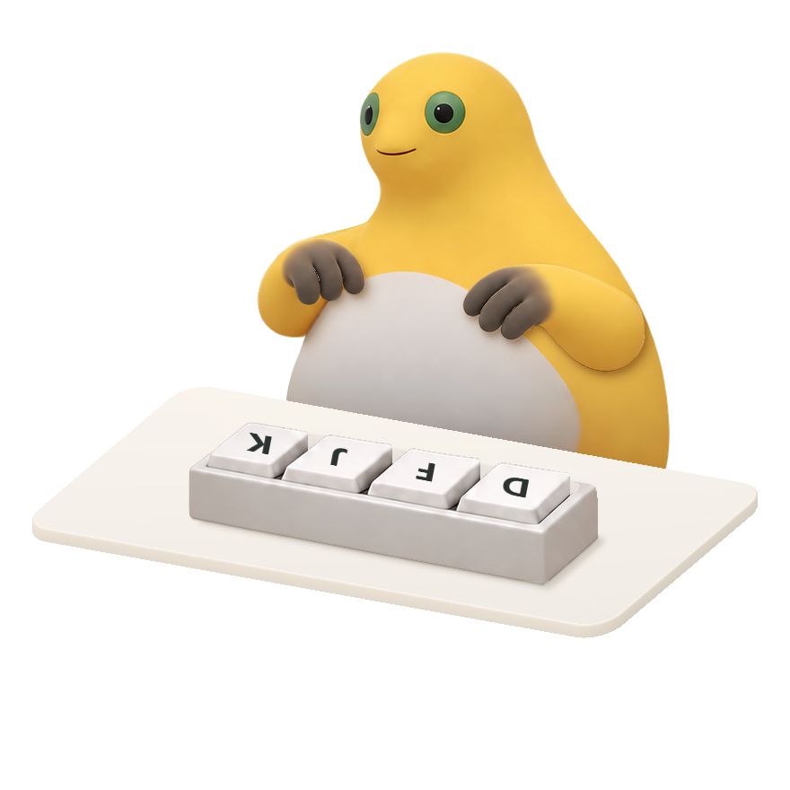

# Mania-Frog

奶蛙音游桌宠与 OBS 原生输入叠加。基于 [Mania-Cat](https://github.com/malad1211/Mania-Cat) 修改，使用透明角色、四键键盘和桌面，支持敲键动作、黄色喷泉粒子及捧腹大笑。

[中文说明](README.zh.md) · [English](README.en.md) · [下载 EXE](https://github.com/Bassssor/Mania-Frog/releases/latest/download/MilkFrog.exe) · [OBS 安装](obs-input-overlay/README.zh.md)

## 直接运行

1. 在 [Releases](https://github.com/Bassssor/Mania-Frog/releases/latest) 下载 `MilkFrog.exe`，双击运行，无需另放 DLL 或素材。
2. 在 Windows 右下角系统托盘找到奶蛙图标，可能位于 **^** 隐藏图标区。
3. 右键图标可放大、缩小、置顶、修改键位、设置“重开大笑键”或退出。左键拖动角色调整位置。

默认敲键为 **D / F / J / K**。修改桌宠键位后，键帽标签同时更新；长功能键名称使用 `SPC`、`ENT`、`LC`、`RC` 等缩写，并限制在键帽内部。

默认按 **F5** 播放一次 9 秒透明捧腹大笑视频及配音，再次按下从头播放；按任意绑定的敲键键位立即停止视频和笑声，恢复敲键动作。可以在托盘将“重开大笑键”改为 **Ctrl+Q** 等组合。

## 仅让观众看到

OBS 使用真正的 **Input Overlay / 输入叠加** 源及本项目的原生动画滤镜，无需运行桌宠 EXE。关闭 OBS 预览后，角色仍进入直播或录制输出。笑声音频源关闭本地监听即可仅进入输出。

下载完整项目，按照 [OBS 中文说明](obs-input-overlay/README.zh.md) 安装。提供的插件面向 **64 位 Windows、OBS 32.2.2**；当前 OBS 敲键映射固定为 DFJK，独立于桌宠的四键设置。“重开大笑键”设置会同步到 OBS。

## 项目内容

| 路径 | 内容 |
| --- | --- |
| `MilkFrog.exe` | 可直接运行的桌宠，内置运行素材与依赖 |
| `obs-input-overlay/` | 原生 OBS 插件、PNG/JSON 预设、图集、视频帧和笑声 |
| `source/` | 最终 C++ 源码、构建工具、角色素材和必要的 SFML 依赖 |
| `preview/seedance-video/` | 已采用的视频预览、透明视频及处理工具 |
| `verification/` | 已完成的标签边界、组合键和 OBS 验证记录 |

获取完整项目：点击 GitHub 页面 **Code → Download ZIP** 并解压，或运行 `git clone https://github.com/Bassssor/Mania-Frog.git`。这是 GitHub 自动生成的源码下载；桌宠可单独下载 EXE 使用。

构建方法见 [源码说明](source/README.zh.md)。上游致谢及组件许可证见 [NOTICE.md](NOTICE.md)。
